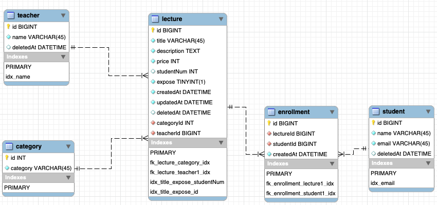

# Node - oop

> 수강생: 회원가입, 탈퇴
> 강의: 목록, 생성, 상세정보, 수정, 삭제
> 수강: 수강등록
> API 구현

## 1. 설계 방향

### 가. Layer 분리

#### Router - Controller - Service - Repository Layer 분리

> 각 기능별 Layer을 분리

1. Router: 경로별 필요한 controller로 라우팅
2. Controller: request 정보 가운데 Service에서 필요한 정보를 추출하여 Service 호출
3. Service: 직접적인 로직이 구현되는 단계 Controller로부터 받은 req 정보를 전달받아 repository에 필요한 형태로 데이터를 가공하여 전달 및 repository에서 전달받은 결과 값을 클라이언트에 전달하기 위해 데이터 가공. 가능한 요청인지(ex. 실제 존재하는 강의를 수강하려고 하는지 확인) 확인하는 기능 수행.
4. Repository: Service에서 전달받은 sql 쿼리를 수행하고 결과 값 전달.

### 나. 의존성 주입

#### typeDi 사용

각 Layer 별 필요한 하위 객체를 내부에서 직접 생성하는 것이 아니라 외부에서 주입하여 사용
새로운 하위 객체를 생성해서 주입하는 것이 아닌 `typedi`를 사용하여 의존성을 주입

### 다. API

#### 강의

`GET` /lecture

- Query Params

  | params | 예시 | 비고 |
  | ----------- | ------------------ | ------------------------------------------------- |
  | limit | limit=400 | 강의 목록의 가장 마지막 id 또는 studentNum 입력 |
  | order | order=student | student -> 수강생순 정렬, 디폴트 값은 최신순 정렬 |
  | category | category=1 | 필터링하는 카테고리의 ID 입력 |
  | title | title=노드강의 | 강의의 강의명 입력 |
  | teacherName | teacherName=인프런 | 강사의 이름 입력 |
  | student | student=1 | 수강생의 ID 입력 |

- Response `200`
  ```json
  {
      "result": [
          {
              id
              title
              description
              category
              price
              studentNum
              createdAt
              teacher
          }...
      ]
  }
  ```

`GET` /lecture:id

- Response `200`
  ```json
  {
      result: {
          id
          title
          description
          category
          price
          studentNum
          createdAt
          updatedAt
          students: [
              {
                  id
                  name
                  enrollmentAt
              },...
          ]
      }
  }
  ```

`POST` /lecture

- Request

  ```json
  {
    title
    description
    price
    teacherId
    categoryId
  }
  ```

- Response `201`
  ```json
  {
    "result": "Success create lecture"
  }
  ```

`PUT` /lecture:id

- Request

  ```json
  {
    title
    description
    price
    expose
  }
  ```

- Response `200`
  ```json
  {
    "result": "Success update lecture"
  }
  ```

`DELETE` /lecture:id

- Response `204`
  ```json
  {
    "result": "Success delete lecture"
  }
  ```

#### 수강생

`POST` /student

- Request

  ```json
  {
    email
    name
  }
  ```

- Response `201`
  ```json
  {
    "result": "Success create student"
  }
  ```

`DELETE` /student:id

- Response `204`
  ```json
  {
    "result": "Success delete student"
  }
  ```

#### 수강

`POST` /enrollment

- Request

  ```json
  {
    studentId,
    lectureIds: []
  }
  ```

- Response `201`
  ```json
  {
    "result": "Success create ${result number} of enrollment"
  }
  ```

### 라. Test

#### 단위 테스트

- Controller, Service에 대해서 모든 동작에 대해 단위 테스트
- 각 단위 테스트를 위해 stub를 사용하여 테스트 더블 객체를 이용

#### 통합 테스트

- 분리된 각 라우터 별로 모든 endpoint에 대해 잘 동작하는지, 예외 처리의 동작이 잘 되는지 검증

---

## 2. 구현 방법, 과정과 고민

### 가. 구현 방법

#### 수강생

- 수강생의 가입 시에 가입을 원하는 email로 중복 검사 후 가입 진행

#### 강의

- 생성 시 강의가 참조하는 강사, 카테고리가 참조할 수 있는 값인지 확인
- 삭제 시 해당 강의의 수강생이 있는지 확인 후 삭제

#### 수강

- 수강신청 시 존재하는 수강인지 확인
- 기존에 수강하는 강의 수강하려고 하는지 확인
- 수강하려고 하는 강의가 존재하는 강의인지 확인
- 문제가 없다면 수강 테이블에 추가 및 강의의 studentNum 값 증가


#### 수강생 수를 관리하는 방법

1. 수강신청 시 수강 테이블에만 수강 정보 추가
2. 방법1 이후 강의 테이블에 studentNum 증가

#### 각 방법별 장점 및 단점

1. 방법1
   - 장점: 수강신청 시 수강 테이블만 update
   - 단점: 강의의 목록을 가져올 때마다 수강 테이블을 조인 추가 계산 과정 필요
2. 방법2
   - 장점: 강의 목록을 가져올 때마다 수강 테이블을 조인 불필요
   - 단점: 수강 정보를 추가할 때마다 강의를 update

#### 두가지 방법중 선택한 방법과 이유

방법2를 선택

- 수강생이 수강신청을 하는 경우보다 여러 사용자가 강의 목록을 요청하는 경우가 더욱 많을 것으로 판단
- 서비스의 행사를 진행함에 따라 수강신청이 증가한다거나 사용자가 많아지는 경우 inMemory DB를 사용하는 방법을 생각
  - 수강생이 수강신청을 할 때 수강 테이블을 update 하고 수강생 수는 inMemory DB에 있는 값을 증가
  - 강의 목록 조회 시 수강생 수 정보는 inMemory DB에 있는 값을 전달
  - inMemory DB를 사용하면 정보가 휘발될 수 있으나 정확한 수강생 수 정보는 수강 테이블에 존재하기 때문에 문제없다고 판단
  - inMemory DB의 값 또는 수강 테이블의 강의별 수강생 수를 조회하여 강의 테이블의 studentNum을 최신 값으로 업데이트하는 cron 작업을 새벽에 진행하면 된다고 생각

#### 추가적인 고민

- 강의의 목록을 전달하는 부분이 가장 많이 호출되는 API
- 강의의 목록을 조회하는 쿼리를 하는 데 있어 최대한 가상 테이블을 만들어 재정렬 또는 풀스캔하는 상황은 좋지 못함
- 위의 상황을 피하기 위해 index를 잘 생성해야 함
- 하지만 강의 검색의 조건에 해당하는 모든 조건에 대해 index를 생성해 주면 index가 너무 많아지는 것이 아닐까..?
- 커버링 인덱스로 사용하려면 어떻게 인덱스를 구성해야 할까

---

## 3. 프로젝트 실행 방법

> pc환경에 Node가 설치되어 있어야 합니다. [Node설치 링크](https://nodejs.org/ko/)
> 아래에 있는 ERD모델로 DB가 준비되어 있어야 합니다.

### 가. 프로젝트 실행 방법

- node_modules 설치

```bash
$ npm install
```

- 서버 구동

```bash
$ npm run start
```

- 단위 테스트

```bash
$ npm run test
```

- 통합 테스트

```bash
$ npm run test-integration
```

---

## 4. ERD



### lecture

- 스키마

  | 컬럼명 | 타입 | 설명 | 비고 |
  |-------------|-------------|---------|-------------------|
  | id | BIGINT | 강의 ID | PK |
  | title | varchar(45) | 강의명 | |
  | description | TEXT | 강의 설명 | |
  | price | INT | 강의 가격 | |
  | studentNum | INT | 수강생 수 | |
  | expose | TINYINT(1) | 강의 노출 값 | |
  | createdAt | DATETIME | 생성일 | |
  | updatedAt | DATETIME | 수정일 | |
  | deletedAt | DATETIME | 삭제일 | |
  | categoryId | INT | 카테고리ID | FK -> category.id |
  | teacherId | INT | 강사ID | FK -> teacher.id |

- 인덱스

  | 인덱스명 | 컬럼 |
  | --------------------------- | ------------------------- |
  | idx_title_expose_studentNum | title, expose, studentNum |
  | idx_title_expose_id | title, expose, id |

### student

- 스키마

  | 컬럼명 | 타입 | 설명 | 비고 |
  |-----------|-------------|-----------|-----|
  | id | BIGINT | 수강생 ID | PK |
  | name | varchar(45) | 수강생 닉네임 | |
  | email | varchar(45) | 수강생 email | |
  | deletedAt | DATETIME | 삭제일 | |

- 인덱스

  | 인덱스명 | 컬럼 |
  |-----------|-------|
  | idx_email | email |

### enrollment

- 스키마

  | 컬럼명 | 타입 | 설명 | 비고 |
  |-----------|----------|--------|------------------|
  | id | BIGINT | 수강 ID | PK |
  | lectureId | BIGINT | 강의 ID | FK -> lecture.id |
  | studentId | BIGINT | 수강생 ID | FK -> student.id |
  | createdAt | DATETIME | 수강 생성일 | |

### teacher

- 스키마

  | 컬럼명 | 타입 | 설명 | 비고 |
  |-----------|-------------|-------|-----|
  | id | BIGINT | 강사 ID | PK |
  | name | varchar(45) | 강사 이름 | |
  | deletedAt | DATETIME | 삭제일 | |

- 인덱스

  | 인덱스명 | 컬럼 |
  |----------|------|
  | idx_name | name |

### category

- 스키마

  | 컬럼명 | 타입 | 설명 | 비고 |
  |----------|-------------|-------------|-----|
  | id | INT | 카테고리 ID | PK |
  | category | varchar(45) | 카테고리(ex. 앱) | |
